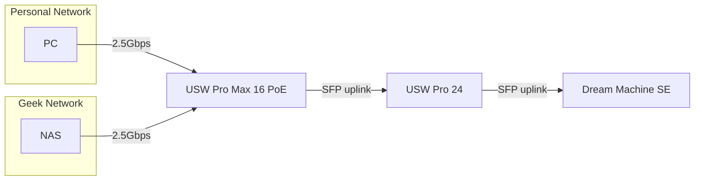
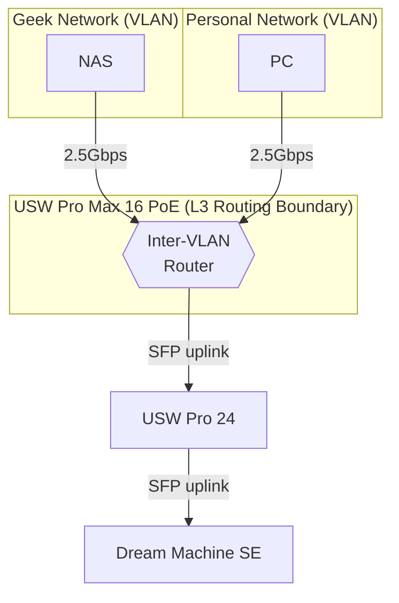

# Inter-VLAN Routing

## Problem Statement
Historically before I built out my network swtiches and there was just a lonely Dream Machine SE I was content with 
being bottlenecked by the 1GBps backplane. However, once I added a USW Pro Max 16 PoE switch which has 4 2.5GBps ports
I wanted to ensure I maximized the potential throughput. 

The problem is, without configuring inter-VLAN routing all packet traffic is between handled by the Dream Machine
and because of that 1GBps backplane, even if the devices on the switch are capable of 2.5GBps, they will be bottlenecked by the Dream Machine's backplane.
This causes two key issues:
1. If two devices on the switch are communicating with each other across VLANs, they will be bottlenecked by the DM as all L3 routing is handled by the networks `router`.
2. As the network expands this is putting more pressure on the DM since it's the central L3 for all the VLANs.

## Solution
The solution is to configure [inter-VLAN routing](https://help.ui.com/hc/en-us/articles/360042281174-Layer-3-Routing) on the switch and make it the deadicated L3 router for the VLANs we wish to route between, 
especially since in this case both high traffic devices on different VLANs happen to be on the same switch. 
This allows the switch to route traffic between VLANs without having to send it to the DM, thus avoiding the 1GBps bottleneck and freeing up the DM to handle other tasks.

## Topology

## VLAN Design

## Configuration

### Setting up an Inter-VLAN Route

<procedure title="Configure The Designated Router for a VLAN">
<step>
    Open the <b>UniFi Network</b> application and navigate to  <path>Settings | Network</path>
</step>
<step>
    Confirm both VLANs exist (e.g. *Personal Network* and *Geek Network*). If not, click **Create New Network** and set the VLAN ID, subnet, and gateway for each.
</step>
<step>
    Select the first VLAN by clicking on it, which will open the network view on the righthand side. 

</step>
<step>
    
Select the `router` i.e switch that you want to deadicate as the router for vlan.

    
I personally choose to select the switch that both these vlans connect to, to improve overall performance by reducing the number of hops between devices on different VLANs.

</step>
<note>
Repeat steps 1-3 for each vlan you wish to run through the Inter-VLAN. Note devices will breifly lose connection has this happens. Give at least 5 minutes for the routes to establish.
</note>
</procedure>

### Reviewing the Inter-VLAN Route

This should create a new entry into the Networking table called `Inter-VLAN Routing` with `VLAN ID` of `4040`.

## Result

So now traffic from the PC  going to the NAS across VLANs should instead of traversing to the Dream Machine SE for routing, will instead 
will be routed by the `USW Pro Max 16 PoE` switch, thus avoiding the 1GBps bottleneck and allowing the devices to communicate at their full potential of 2.5Gbps.

<warning>
If traffic is still routing through the Dream Machine SE after configuration, confirm that the switch firmware supports L3 routing — USW Pro Max 16 PoE requires firmware **6.x** or later.
</warning>

