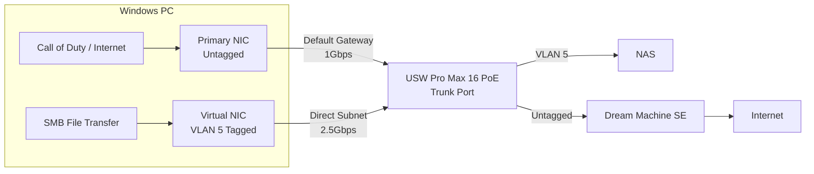

# OS-Level VLAN Tagging for Dual-Homed Workstation

## Problem Statement

Following on from the previous topic of [Inter-VLAN Routing](Inter-VLAN-Routing.md), the next problem I encountered was that while the L3 routing on the switch allowed for high-speed inter-VLAN traffic, 
it caused issues with external port forwarding and NAT due to [asymmetric routing](https://www.cisco.com/web/services/news/ts_newsletter/tech/chalktalk/archives/200903.html). The UDM SE's firewall would drop returning packets from the L3 switch, 
breaking UDP hole-punching and resulting in "Moderate" or "Strict" NAT types in games.

When expanding a home lab to include high-speed 2.5Gbps switches (like the USW Pro Max 16 PoE) behind a 1Gbps router (Dream Machine SE), a conflict arises between high-speed internal routing and external port forwarding (NAT).

If the internal networks are routed via Layer 3 on the switch, inter-VLAN traffic achieves 2.5Gbps. However, this causes asymmetric routing for external traffic. The UDM SE's stateful firewall will often silently drop returning packets from the L3 switch, completely breaking UDP hole-punching and Port Forwarding. This results in "Moderate" or "Strict" NAT types in games like Call of Duty.

Reverting the network routing back to the UDM SE fixes the NAT and Port Forwarding, but creates a 1GBps bottleneck for heavy internal traffic (like PC to NAS file transfers).

## Solution
The solution is to bypass Layer 3 routing entirely and use Layer 2 **OS-Level VLAN Tagging**. By creating a "Dual-Homed" configuration on the PC, we can split the physical network cable into two virtual paths:
1. **Untagged Traffic (Primary):** Routed by the UDM SE. This handles the default gateway, internet access, and gaming traffic, ensuring Port Forwarding works perfectly for an "Open" NAT.
2. **Tagged Traffic (Secondary):** Tagged with the NAS VLAN ID (e.g., VLAN 5). This creates a direct logical link to the NAS subnet. Because the PC is virtually on the same subnet as the NAS, traffic bypasses the UDM SE firewall entirely and travels across the switch's high-speed ASIC at 2.5Gbps.

## Topology

## Configuration

### Phase 1: Configuring the Switch Port (Trunking)

<warning title="Important Note">
In the eariler article I mentioned about putting both VLANS on to the Inter-VLAN. During the process of 
working this out, I moved the `personal` VLAN back under the `Dream Machine SE`. 

This is an important point, as 
by default in this solution untagged traffic will hit the Dream Machines backplane which caps throughput to 1Gbps
however, in the solution below any inter-VLAN traffic to Geek will run at max capacity due to how the traffic is routed.
</warning>
<procedure title="Enable Tagged Traffic on the PC's Switch Port">
<step>
Open the <b>UniFi Network</b> application and navigate to <path>UniFi Devices | USW Pro Max 16 PoE</path>.
</step>
<step>
Go to the Port Manager and click on the port connected to the PC.
</step>
<step>
Set the Primary Network (Native VLAN) to the primary network (e.g., Personal Network). This is the untagged network.
</step>
<step>

Scroll down to Advanced, set Traffic Restriction to Custom, and ensure the Geek Network (VLAN 5) is checked under Allowed Networks. Apply changes.

<b>OR</b>

if you have `Allow All` ticked, then you can just leave this as-is.

</step>
<note>
This configures the port as a "Trunk", allowing it to pass the standard Personal Network natively, while silently carrying the Geek Network for devices that know to look for it.
</note>
</procedure>

Phase 2: Creating the Virtual Bridge in Windows
<procedure title="Configure Hyper-V Virtual Switch and Tagging">
<step>
Open PowerShell as an Administrator.
</step>
<step>
Identify the exact name of your physical high-speed network adapter by running:
<code>Get-NetAdapter | Where-Object {$_.Virtual -eq $false}</code>
</step>
<step>
Create a new External Virtual Switch bound to that physical adapter (e.g., "10G Nic"):
<code>New-VMSwitch -Name "PhysicalBridge" -NetAdapterName "10G Nic" -AllowManagementOS $true</code>
</step>
<step>
Add a new virtual network adapter for the host OS to use for the NAS connection:
<code>Add-VMNetworkAdapter -ManagementOS -Name "Geek-VLAN" -SwitchName "PhysicalBridge"</code>
</step>
<step>
Apply the specific VLAN ID (e.g., 5) to this new virtual adapter:
<code>Set-VMNetworkAdapterVlan -ManagementOS -VMNetworkAdapterName "Geek-VLAN" -Access -VlanId 5</code>
</step>
<warning>
Running the <code>New-VMSwitch</code> command will temporarily drop the network connection for a few seconds while Windows rebinds the physical card to the virtual bridge.
</warning>
</procedure>

Phase 3: IP Configuration and Routing Priority
<procedure title="Assign Static IP and Prevent Default Gateway Conflicts">
<step>
Press <code>Win + R</code>, type <code>ncpa.cpl</code>, and press Enter to open Network Connections.
</step>
<step>
Right-click the newly created vEthernet (Geek-VLAN) adapter and select Properties.
</step>
<step>
Select Internet Protocol Version 4 (TCP/IPv4) and click Properties.
</step>
<step>
Assign a static IP address within the Geek Network subnet (e.g., <code>192.168.X.Y</code>) and the appropriate Subnet Mask.
</step>
<step>
Crucial Step: Leave the Default Gateway and DNS Servers completely blank. Click OK.
</step>
<note>
Leaving the gateway blank forces Windows to use this adapter ONLY for traffic destined for the exact 192.168.55.x subnet. All internet and gaming traffic will naturally fall back to the primary untagged adapter. Windows will display this adapter as an "Unidentified Network", which is expected and normal.
</note>
</procedure>

## Result
Traffic directed to the internet or game servers uses the primary IP, routes through the Dream Machine SE, and correctly establishes an Open NAT via port forwarding.

Conversely, when the PC requests data from the NAS at 192.168.55.14, the OS routing table recognizes the localized Geek-VLAN interface. It tags the packets with VLAN 5 and sends them directly to the switch, avoiding the firewall entirely and sustaining continuous 1.8Gbps+ transfer speeds.