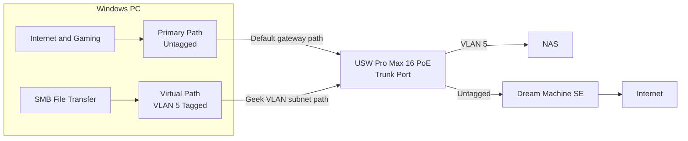

# OS-Level VLAN Tagging for Dual-Homed Workstation

## Runbook Goal

Use one physical PC link to keep:
- internet and game traffic on the untagged Personal network (via Dream Machine SE), and
- NAS traffic on a tagged Geek VLAN path at switch speed.

This avoids asymmetric routing side effects from L3 inter-VLAN routing while preserving high-throughput NAS transfers.

## When to Use This Runbook

- You previously enabled L3 inter-VLAN routing for performance.
- Port forwarding or game NAT became unreliable (Moderate/Strict NAT).
- Your PC and NAS are connected through `USW Pro Max 16 PoE`.

## Prerequisites

- UniFi controller access with permission to edit switch port profiles.
- Windows PC with Hyper-V available.
- One physical NIC on the PC connected to `USW Pro Max 16 PoE`.
- VLAN details for:
  - Personal network (untagged/native)
  - Geek network (tagged, example VLAN `5`)
- NAS subnet details (example `192.168.55.0/24`).

<warning title="Scope">
This runbook is for host-level VLAN tagging on Windows using Hyper-V virtual adapters. It does not re-enable L3 inter-VLAN routing on the switch.
</warning>

<warning title="Important Assumption from Previous Article">
This runbook assumes the <b>Personal</b> VLAN is routed by the <b>Dream Machine SE</b>, not by switch Inter-VLAN routing.
If Personal is still attached to switch-side Inter-VLAN routing from the previous design, NAT and port-forwarding behavior can break again.
Review context in <a href="Inter-VLAN-Routing.md">Inter-VLAN Routing</a> before applying these steps.
</warning>

## Topology

## Execution

### Phase 1: Configure the Switch Port as Trunk

<procedure title="Allow Personal (native) and Geek (tagged) on the PC port">
<step>
Open <b>UniFi Network</b> and navigate to <path>UniFi Devices | USW Pro Max 16 PoE</path>.
</step>
<step>
Open <b>Ports</b> (or Port Manager) and select the port connected to the PC.
</step>
<step>
Set the <b>Primary Network</b> (Native VLAN) to <b>Personal</b>.
</step>
<step>
Under advanced VLAN settings, allow <b>Geek Network (VLAN 5)</b> as tagged traffic on that same port.
</step>
<step>
Apply changes and wait for the port to reprovision.
</step>
</procedure>

<note>
If the port profile is configured as "Allow All", tagged VLAN 5 is already permitted.
</note>

### Phase 2: Create the Windows Tagged Interface

<procedure title="Create Hyper-V virtual switch and VLAN-tagged adapter">
<step>
Open PowerShell as Administrator.
</step>
<step>
Identify your physical adapter name:
<code-block lang="powershell">
Get-NetAdapter | Where-Object { $_.Virtual -eq $false }
</code-block>
</step>
<step>
Create an external virtual switch bound to the physical adapter:
<code-block lang="powershell">
New-VMSwitch -Name "PhysicalBridge" `
  -NetAdapterName "10G Nic" `
  -AllowManagementOS $true
</code-block>
</step>
<step>
Create a host virtual adapter for Geek VLAN traffic:
<code-block lang="powershell">
Add-VMNetworkAdapter -ManagementOS `
  -Name "Geek-VLAN" `
  -SwitchName "PhysicalBridge"
</code-block>
</step>
<step>
Apply VLAN tagging to the new adapter:
<code-block lang="powershell">
Set-VMNetworkAdapterVlan -ManagementOS `
  -VMNetworkAdapterName "Geek-VLAN" `
  -Access -VlanId 5
</code-block>
</step>
</procedure>

<warning>
`New-VMSwitch` briefly interrupts connectivity while Windows rebinds the NIC.
</warning>

### Phase 3: Set IP Without Gateway on Tagged Adapter

<procedure title="Keep NAS path local and avoid default route conflicts">
<step>
Open Network Connections (`ncpa.cpl`).
</step>
<step>
Open properties for `vEthernet (Geek-VLAN)`.
</step>
<step>
Configure IPv4 with a static address in the NAS subnet (example `192.168.55.20/24`).
</step>
<step>
Leave <b>Default Gateway</b> and <b>DNS</b> empty on this adapter.
</step>
<step>
Save and close.
</step>
</procedure>

<note>
No gateway on the tagged adapter ensures only Geek subnet traffic uses this path. Internet traffic continues via the untagged Personal path.
</note>

## Verification

<procedure title="Validate routing behavior and expected outcomes">
<step>
Confirm the tagged adapter exists and has the expected IPv4:
<code-block lang="powershell">
Get-NetIPAddress `
  -InterfaceAlias "vEthernet (Geek-VLAN)" `
  -AddressFamily IPv4
</code-block>
</step>
<step>
Confirm route preference for NAS subnet:
<code-block lang="powershell">
route print
</code-block>

Verify the NAS subnet route points to `vEthernet (Geek-VLAN)`.

</step>
<step>
Test local NAS reachability:
<code-block lang="powershell">
ping 192.168.55.14
</code-block>
</step>
<step>
Run a file transfer test to NAS and confirm high throughput (target similar to prior baseline, e.g. `~1.8Gbps+` in your environment).
</step>
<step>
Validate gaming/internet path still uses the primary interface and NAT returns to Open where expected.
</step>
</procedure>

## Rollback

<procedure title="Return to pre-change state">
<step>
Remove VLAN-tagged host adapter:
<code-block lang="powershell">
Remove-VMNetworkAdapter -ManagementOS -Name "Geek-VLAN"
</code-block>
</step>
<step>
If needed, remove external switch:
<code-block lang="powershell">
Remove-VMSwitch -Name "PhysicalBridge" -Force
</code-block>
</step>
<step>
Restore original UniFi port profile for the PC port.
</step>
</procedure>

## Troubleshooting

- `No NAS connectivity`: confirm VLAN 5 is allowed on switch port and tagged adapter VLAN ID is `5`.
- `Internet breaks after switch creation`: wait for NIC rebind, then verify primary adapter default gateway.
- `Traffic still hairpins through router`: check Geek adapter has no default gateway and correct subnet mask.
- `NAT still Moderate/Strict`: confirm game/device port forwarding is mapped to the primary untagged Personal IP.
